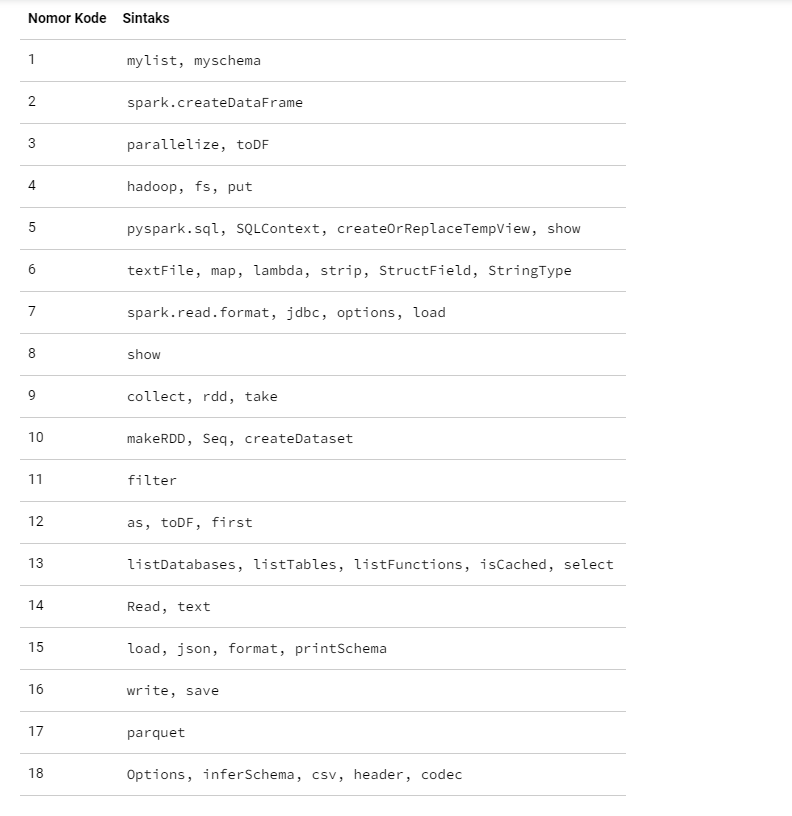

# BigData_Chapter4
1. Silakan selesaikan praktikum tersebut sesuai langkah-langkah sebelumnya, lalu laporkan hasilnya berupa link repository GitHub dengan nama spark-sql-big-data disertai dengan screenshot hasilnya.
2. Jelaskan masing-masing maksud kode berikut sesuai nomor kodenya pada laporan praktikum Anda!

<b>1.</b>
<table border="0">
 <tr>
    <td><b style="font-size:30px">Kode</b></td>
    <td><b style="font-size:30px">Keterangan</b></td>
 </tr>
 <tr>
    <td>mylist</td>
    <td>mylist pada Python adalah tipe data list yang digunakan untuk menyimpan kumpulan objek dalam satu variabel. Dalam Python, list dapat berisi objek apa saja seperti string, angka, bahkan list lain</td>
 </tr>
 <tr>
    <td>myschema</td>
    <td>myschema pada Python tidak merujuk pada tipe data bawaan di Python. Namun, jika Anda merujuk pada penggunaan schema di Python, biasanya schema digunakan untuk mendefinisikan struktur data yang terdiri dari beberapa field dengan tipe data yang berbeda.Pada umumnya, schema ini digunakan untuk mengelola data dalam format yang terstruktur, seperti file CSV, file JSON, atau database.mylist pada Python adalah tipe data list yang digunakan untuk menyimpan kumpulan objek dalam satu variabel.</td>
 </tr>
 
</table>

<b>2.</b>
<table border="0">
 <tr>
    <td><b style="font-size:30px">Kode</b></td>
    <td><b style="font-size:30px">Keterangan</b></td>
 </tr>
 <tr>
    <td>spark.createDataFrame</td>
    <td>create DataFrame adalah istilah umum yang merujuk pada pembuatan DataFrame di berbagai platform pengolahan data, termasuk PySpark. Dalam PySpark, kita dapat menggunakan fungsi spark.createDataFrame() untuk membuat DataFrame dari data yang ada di PySpark RDD, list, atau tuple. </td>
 </tr>
 
</table>

<b>3.</b>
<table border="0">
 <tr>
    <td><b style="font-size:30px">Kode</b></td>
    <td><b style="font-size:30px">Keterangan</b></td>
 </tr>
 <tr>
    <td>parallelize</td>
    <td>parallelize() adalah sebuah fungsi pada PySpark yang digunakan untuk mengubah data dalam bentuk list atau tuple menjadi RDD (Resilient Distributed Datasets) yang dapat diproses secara paralel di dalam cluster Spark. Dalam proses paralelisasi data, Spark akan memecah data menjadi beberapa bagian (partisi) yang akan diproses secara terpisah pada setiap node di dalam cluster.</td>
 </tr>
 <tr>
    <td>toDF</td>
    <td>toDF() adalah sebuah fungsi pada PySpark yang digunakan untuk mengubah RDD (Resilient Distributed Datasets) menjadi DataFrame. Dalam proses ini, PySpark akan menentukan schema (struktur kolom dan tipe data) DataFrame secara otomatis berdasarkan tipe data dari setiap elemen RDD. Jika RDD berisi tuple, maka setiap elemen tuple akan dianggap sebagai satu baris data dalam DataFrame.</td>
 </tr>
</table>

<b>4.</b>
<table border="0">
 <tr>
    <td><b style="font-size:30px">Kode</b></td>
    <td><b style="font-size:30px">Keterangan</b></td>
 </tr>
 <tr>
    <td>parallelize</td>
    <td>parallelize() adalah sebuah fungsi pada PySpark yang digunakan untuk mengubah data dalam bentuk list atau tuple menjadi RDD (Resilient Distributed Datasets) yang dapat diproses secara paralel di dalam cluster Spark. Dalam proses paralelisasi data, Spark akan memecah data menjadi beberapa bagian (partisi) yang akan diproses secara terpisah pada setiap node di dalam cluster.</td>
 </tr>
 <tr>
    <td>toDF</td>
    <td>toDF() adalah sebuah fungsi pada PySpark yang digunakan untuk mengubah RDD (Resilient Distributed Datasets) menjadi DataFrame. Dalam proses ini, PySpark akan menentukan schema (struktur kolom dan tipe data) DataFrame secara otomatis berdasarkan tipe data dari setiap elemen RDD. Jika RDD berisi tuple, maka setiap elemen tuple akan dianggap sebagai satu baris data dalam DataFrame.</td>
 </tr>
</table>

<b>4.</b>
<table border="0">
 <tr>
    <td><b style="font-size:30px">Kode</b></td>
    <td><b style="font-size:30px">Keterangan</b></td>
 </tr>
 <tr>
    <td>hadoop</td>
    <td>Hadoop pada Spark digunakan untuk memproses data secara terdistribusi di dalam cluster. Hadoop adalah framework open-source yang digunakan untuk mengelola data dan menghitung data yang sangat besar pada cluster terdistribusi. Spark dapat berintegrasi dengan Hadoop untuk memanfaatkan sistem file Hadoop HDFS dan framework pengolahan batch Apache Hadoop MapReduce.</td>
 </tr>
 <tr>
    <td>fs</td>
    <td>fs pada Spark Python (PySpark) adalah singkatan dari File System, yang merupakan antarmuka untuk berinteraksi dengan sistem file di dalam cluster Spark. Dengan menggunakan antarmuka fs pada PySpark, kita dapat membaca, menulis, dan memanipulasi berbagai jenis file seperti CSV, JSON, Parquet, Avro, dan lain-lain pada Hadoop Distributed File System (HDFS) dan local file system.</td>
 </tr>
 <tr>
    <td>put</td>
    <td>put merupakan operasi untuk menulis file ke dalam HDFS (Hadoop Distributed File System) atau sistem file lainnya yang didukung oleh Spark.</td>
 </tr>
 </table>

<b>5.</b>
<table border="0">
 <tr>
    <td><b style="font-size:30px">Kode</b></td>
    <td><b style="font-size:30px">Keterangan</b></td>
 </tr>
 <tr>
    <td>pyspark.sql</td>
    <td>pyspark.sql adalah modul di PySpark yang menyediakan antarmuka DataFrame yang lebih tinggi dan lebih efisien daripada RDD (Resilient Distributed Dataset). Modul ini digunakan untuk memproses data dalam skala besar secara terdistribusi pada Spark.Membaca dan menulis data dari berbagai sumber seperti CSV, JSON, dan parquet, Memproses data dengan menggunakan SQL atau fungsi DataFrame pada PySpark</td>
 </tr>
 <tr>
    <td>SQLContext</td>
    <td>SQLContext adalah entry point dari modul PySpark SQL. Dengan menggunakan SQLContext, kita dapat membaca dan menulis data dari berbagai sumber seperti CSV, JSON, dan parquet. Selain itu, SQLContext juga menyediakan antarmuka untuk memproses data dengan menggunakan SQL atau fungsi DataFrame pada PySpark.</td>
 </tr>
 <tr>
    <td>createOrReplaceTempView</td>
    <td>createOrReplaceTempView adalah fungsi pada PySpark yang digunakan untuk membuat atau mengganti view sementara dari DataFrame yang diberikan. View sementara adalah tampilan tabel virtual dari DataFrame yang dapat digunakan untuk menjalankan perintah SQL pada DataFrame tersebut.Dalam PySpark, createOrReplaceTempView dapat digunakan untuk memproses data menggunakan SQL pada DataFrame, tanpa perlu melakukan konversi DataFrame menjadi tabel SQL terlebih dahulu. Fungsi ini dapat menggantikan fungsi createTempView dan replaceTempView pada versi sebelumnya dari PySpark.</td>
 </tr>
 <tr>
    <td>show</td>
    <td>show() adalah fungsi pada PySpark yang digunakan untuk menampilkan isi dari DataFrame dalam bentuk tabel. Fungsi ini dapat digunakan untuk memeriksa hasil operasi pada DataFrame, seperti transformasi dan pemrosesan data.</td>
 </tr>
</table>

<b>6.</b>
<table border="0">
 <tr>
    <td><b style="font-size:30px">Kode</b></td>
    <td><b style="font-size:30px">Keterangan</b></td>
 </tr>
 <tr>
    <td>textFile</td>
    <td>textFile() adalah fungsi pada PySpark yang digunakan untuk membaca file teks sebagai RDD (Resilient Distributed Dataset). Fungsi ini dapat membaca file yang disimpan dalam format teks, seperti file CSV, TSV, dan TXT. </td>
 </tr>
 <tr>
    <td>map</td>
    <td>map() adalah sebuah fungsi pada PySpark yang digunakan untuk melakukan transformasi pada setiap elemen RDD. Fungsi ini mengambil sebuah fungsi sebagai parameter dan menerapkannya pada setiap elemen RDD, sehingga menghasilkan RDD baru.</td>
 </tr>
 <tr>
    <td>lambda</td>
    <td>Pada Spark, lambda digunakan untuk membuat anonymous function yang dapat digunakan dalam operasi transformasi data seperti pada method map, filter, reduce, dan lain-lain. Lambda function memungkinkan penggunaan function yang pendek dan sederhana tanpa harus menuliskan kode function secara terpisah.</td>
 </tr>
  <tr>
    <td>strip</td>
    <td>Pada Spark, method strip() digunakan untuk menghapus whitespace atau karakter tertentu di awal dan akhir sebuah string dalam RDD. Method ini seringkali digunakan pada operasi transformasi data seperti map atau flatMap</td>
 </tr>
  <tr>
    <td>structField</td>
    <td>StructField mendefinisikan tipe data kolom dan nama kolom yang sesuai. Kelas ini sering digunakan bersama dengan kelas.</td>
 </tr>
  <tr>
    <td>stringType</td>
    <td>StringType pada Spark digunakan untuk merepresentasikan tipe data string dalam DataFrame. Tipe data ini dapat digunakan sebagai tipe data kolom pada schema DataFrame, yaitu sebagai salah satu jenis StructField. Data dengan tipe StringType dalam DataFrame dapat diubah atau dimanipulasi dengan menggunakan fungsi-fungsi yang disediakan oleh Spark SQL.</td>
 </tr>
</table>

<b>7.</b>
<table border="0">
 <tr>
    <td><b style="font-size:30px">Kode</b></td>
    <td><b style="font-size:30px">Keterangan</b></td>
 </tr>
 <tr>
    <td>spark.read.format</td>
    <td>spark.read.format() adalah metode pada Spark yang digunakan untuk membaca data dari berbagai sumber data eksternal. Metode ini memungkinkan kita untuk menentukan format file input seperti CSV, JSON, Parquet, Avro, dan banyak lagi.</td>
 </tr>
 <tr>
    <td>jdbc</td>
    <td>JDBC (Java Database Connectivity) adalah sebuah API (Application Programming Interface) pada bahasa pemrograman Java yang digunakan untuk mengakses database relasional. JDBC memungkinkan aplikasi Java untuk terhubung ke database dan mengirimkan perintah-perintah SQL ke database tersebut.</td>
 </tr>
 <tr>
    <td>options</td>
    <td>options pada Spark digunakan untuk memberikan konfigurasi pada pembacaan data dari sumber eksternal seperti database, file, atau sumber data lainnya. Dalam pembacaan data dari sumber eksternal, Spark memerlukan informasi tambahan seperti alamat sumber data, kredensial login, dan konfigurasi lainnya.</td>
 </tr>
  <tr>
    <td>load</td>
    <td>Fungsi load() pada Spark digunakan untuk membaca data dari berbagai sumber data, seperti file teks, file CSV, tabel basis data, dan banyak lagi. Fungsi ini dapat membaca data dan mengembalikannya sebagai DataFrame, yang dapat diproses menggunakan operasi Spark DataFrame yang berbeda. </td>
 </tr>
</table>

<b>8.</b>
<table border="0">
 <tr>
    <td><b style="font-size:30px">Kode</b></td>
    <td><b style="font-size:30px">Keterangan</b></td>
 </tr>
 <tr>
    <td>show</td>
    <td>Fungsi show() pada Spark digunakan untuk menampilkan sejumlah baris (10 baris secara default) dari Dataframe atau Dataset yang diberikan. Fungsi ini sangat berguna untuk mengecek isi dari Dataframe atau Dataset tersebut dan melakukan debugging atau eksplorasi data. Secara default, show() akan menampilkan 20 baris pertama dari data, tetapi dapat diatur jumlah baris yang ingin ditampilkan dengan mengisi argumen pada fungsi tersebut. </td>
 </tr> 
</table>

<b>9.</b>
<table border="0">
 <tr>
    <td><b style="font-size:30px">Kode</b></td>
    <td><b style="font-size:30px">Keterangan</b></td>
 </tr>
 <tr>
    <td>collect</td>
    <td>Fungsi collect() pada Spark digunakan untuk mengambil seluruh data pada RDD (Resilient Distributed Dataset) dan mengembalikan array yang terdiri dari data pada RDD tersebut. Fungsi ini biasanya digunakan setelah melakukan operasi transformasi pada RDD sehingga data pada RDD tersebut dapat dikumpulkan kembali ke driver program atau disimpan ke tempat penyimpanan yang lain.</td>
 </tr>
 <tr>
    <td>rdd</td>
    <td>RDD (Resilient Distributed Datasets) pada Spark digunakan untuk merepresentasikan sebuah kumpulan data yang didistribusikan secara terdistribusi dan tahan terhadap kegagalan. RDD merupakan unit dasar pemrosesan data pada Spark dan memungkinkan pengguna untuk melakukan transformasi dan aksi pada data yang terdistribusi secara paralel di dalam sebuah cluster. </td>
 </tr>
 <tr>
    <td>take</td>
    <td>Metode take pada Spark digunakan untuk mengambil n elemen pertama dari RDD dan mengembalikannya sebagai array dalam Python atau daftar dalam Scala.</td>
 </tr>
</table>

<b>10.</b>
<table border="0">
 <tr>
    <td><b style="font-size:30px">Kode</b></td>
    <td><b style="font-size:30px">Keterangan</b></td>
 </tr>
 <tr>
    <td>makeRDD</td>
    <td>makeRDD() adalah sebuah method pada SparkContext yang digunakan untuk membuat sebuah Resilient Distributed Dataset (RDD) dari data yang diberikan. Data dapat berupa list, tuple, maupun set, dan dapat dibuat menjadi RDD yang dapat didistribusikan pada cluster. </td>
 </tr>
 <tr>
    <td>seq</td>
    <td>seq pada Spark tidak tersedia sebagai fungsi bawaan dalam Spark API. Namun, di Scala, seq adalah metode bawaan dari tipe data Range, yang dapat digunakan untuk membuat kumpulan bilangan bulat berurutan.</td>
 </tr>
 <tr>
    <td>createDataset</td>
    <td>createDataset adalah sebuah metode pada Spark yang digunakan untuk membuat dataset dari sebuah kumpulan data dalam bentuk list atau iterable objects pada Python. Dataset merupakan salah satu fitur Spark yang memungkinkan pemrosesan data dalam bentuk yang sama seperti DataFrame namun dengan tipe data yang terdefinisi dengan jelas dan juga memiliki API yang lebih kuat.</td>
 </tr>
</table>

<b>11.</b>
<table border="0">
 <tr>
    <td><b style="font-size:30px">Kode</b></td>
    <td><b style="font-size:30px">Keterangan</b></td>
 </tr>
 <tr>
    <td>filter</td>
    <td>filter adalah salah satu fungsi yang tersedia di Spark untuk melakukan operasi transformasi pada RDD (Resilient Distributed Datasets). Fungsi ini digunakan untuk memfilter elemen-elemen RDD yang sesuai dengan kondisi tertentu, dengan mengembalikan sebuah RDD baru yang hanya berisi elemen yang memenuhi kondisi tersebut. </td>
 </tr>
</table>

<b>12.</b>
<table border="0">
 <tr>
    <td><b style="font-size:30px">Kode</b></td>
    <td><b style="font-size:30px">Keterangan</b></td>
 </tr>
 <tr>
    <td>as</td>
    <td>as pada Spark digunakan untuk memberikan alias atau nama baru pada suatu DataFrame atau kolom pada DataFrame. Alias atau nama baru yang diberikan dengan as dapat digunakan untuk referensi pada operasi-transformasi berikutnya pada DataFrame.</td>
 </tr>
 <tr>
    <td>toDF</td>
    <td>Fungsi toDF() pada Spark digunakan untuk mengonversi sebuah RDD (Resilient Distributed Dataset) menjadi sebuah DataFrame pada Spark. DataFrame adalah kumpulan data terdistribusi yang disusun ke dalam bentuk kolom. Fungsi toDF() menerima daftar nama kolom dan mengembalikan DataFrame yang berisi data RDD dengan nama kolom yang sesuai.</td>
 </tr>
 <tr>
    <td>first</td>
    <td>Fungsi first() pada Spark digunakan untuk mengambil elemen pertama dari sebuah RDD atau DataFrame. Misalnya, jika kita memiliki sebuah RDD dengan beberapa elemen, maka kita dapat menggunakan first() untuk mengambil elemen pertama dari RDD tersebut.</td>
 </tr>
</table>

<b>13.</b>
<table border="0">
 <tr>
    <td><b style="font-size:30px">Kode</b></td>
    <td><b style="font-size:30px">Keterangan</b></td>
 </tr>
 <tr>
    <td>listDatabases</td>
    <td>listDatabases() pada Spark digunakan untuk menampilkan daftar semua database yang tersedia di cluster Spark. Fungsi ini digunakan ketika Anda ingin mendapatkan informasi tentang database yang tersedia di cluster dan ingin mengaksesnya untuk melakukan operasi tertentu. Perlu diketahui bahwa fungsi ini hanya tersedia pada Spark SQL dan memerlukan SparkSession untuk digunakan.</td>
 </tr>
 <tr>
    <td>listTables</td>
    <td>listTables adalah sebuah method yang tersedia di dalam objek Catalog pada Apache Spark. Method ini digunakan untuk menampilkan daftar tabel yang tersedia dalam database Spark</td>
 </tr>
 <tr>
    <td>listFunctions</td>
    <td>Fungsi listFunctions() pada Spark SQL digunakan untuk mendapatkan daftar semua fungsi yang terdaftar di SparkSession saat ini. Ini termasuk fungsi bawaan Spark SQL dan juga fungsi yang didefinisikan oleh pengguna.</td>
 </tr>
 <td>isCached</td>
    <td>Fungsi isCached() pada Spark digunakan untuk memeriksa apakah suatu DataFrame atau RDD sudah di-cache atau belum. DataFrame atau RDD yang di-cache akan disimpan di memori untuk mempercepat akses data di operasi selanjutnya.</td>
 </tr>
 <tr>
    <td>select</td>
    <td>Fungsi select pada Spark digunakan untuk memilih satu atau beberapa kolom dari DataFrame. Fungsi ini juga dapat digunakan untuk mengubah nama kolom atau menambahkan kolom baru dengan menghitung atau mentransformasi kolom yang ada.</td>
 </tr>
</table>

<b>14.</b>
<table border="0">
 <tr>
    <td><b style="font-size:30px">Kode</b></td>
    <td><b style="font-size:30px">Keterangan</b></td>
 </tr>
 <tr>
    <td>read</td>
    <td>berbagai sumber data seperti file, database, dan streaming data. Pada saat membaca data, kita dapat menentukan format data yang ingin dibaca seperti CSV, JSON, dan parquet. Selain itu, kita juga dapat menentukan skema data atau menggunakan inferSchema untuk menentukan skema data secara otomatis. Metode read mengembalikan objek DataFrame atau Dataset tergantung pada API Spark yang digunakan.</td>
 </tr>
 <tr>
    <td>texts</td>
    <td>Fungsi text pada Spark digunakan untuk membaca file teks sebagai RDD, di mana setiap baris dalam file teks akan menjadi elemen dalam RDD.</td>
 </tr>
 </table>
 
 <b>15.</b>
<table border="0">
 <tr>
    <td><b style="font-size:30px">Kode</b></td>
    <td><b style="font-size:30px">Keterangan</b></td>
 </tr>
 <tr>
    <td>load</td>
    <td>Fungsi load pada Spark digunakan untuk memuat data dari berbagai sumber seperti file, basis data, atau sumber data lainnya ke dalam RDD, DataFrame, atau Dataset. Fungsi load dapat membaca data dalam berbagai format seperti CSV, JSON, Parquet, Avro, dll.</td>
 </tr>
 <tr>
    <td>json</td>
    <td>json dalam Spark digunakan untuk membaca data JSON dan mengonversinya menjadi DataFrame. Spark mendukung membaca data JSON dari berbagai sumber, termasuk file sistem lokal, Hadoop Distributed File System (HDFS), dan sistem penyimpanan data lainnya yang kompatibel dengan Hadoop. Selain itu, json dapat digunakan untuk menulis data dari DataFrame ke format JSON dan menyimpannya ke berbagai sistem penyimpanan data.</td>
 </tr>
  <tr>
    <td>format</td>
    <td>format() pada Spark digunakan untuk menggabungkan nilai-nilai ke dalam string dengan format tertentu.Sebagai contoh, jika kita memiliki variabel name dan age, kita dapat menggunakan format() untuk memasukkan nilai tersebut ke dalam sebuah string.</td>
 </tr>
  <tr>
    <td>printSchema</td>
    <td>printSchema() adalah method pada objek DataFrame di Spark yang digunakan untuk menampilkan schema atau struktur dari DataFrame tersebut. Schema merupakan definisi dari kolom-kolom atau field-field yang ada pada sebuah DataFrame, seperti nama kolom, tipe data, dll. Dengan menggunakan printSchema(), kita bisa mengecek secara cepat dan mudah struktur DataFrame untuk memastikan data sudah di-load dengan benar dan sesuai dengan ekspektasi.</td>
 </tr>
 </table>
 
 
